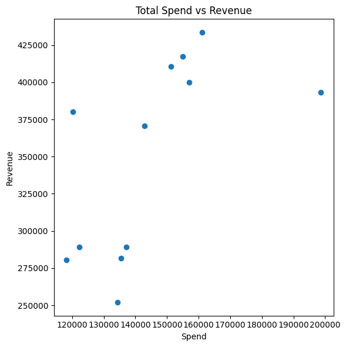

# E‑commerce Growth & Retention Case Study

## 1. Project Story

Acme E‑commerce is on a mission to use data-driven insights to fuel sustainable growth. By bringing together customer demographics, transaction history, marketing spend, discount usage and product‑level tax information, the company wants to pinpoint the drivers of acquisition, retention and revenue. The ultimate goal is to build repeatable strategies that maximize the lifetime value of every customer while optimizing marketing and discount investments across the calendar.

## 2.  Data Overview
| File                   | Rows   | Grain                   | Key Variables                                         |
|------------------------|--------|-------------------------|-------------------------------------------------------|
| `Online_Sales.csv`     | 52,924 | Line‑item transactions  | `transaction_date`, `avg_price`, `delivery_charges`   |
| `CustomersData.xlsx`   | 1468   | Customer master         | `customerid`, `demographics`                          |   
| `Marketing_Spend.csv`  | 365    | Monthly budget          | `online_spend`, `offline_spend`                       |
| `Discount_Coupon.csv`  | 204    | Campaign plan           | `month`, `product_category`, `discount_pct`           |
| `Tax_Amount.xlsx`      | 20     | Tax schedule            | `product_category`, `gst`                             |
                                             |

## 3. Business Questions

1. **Acquisition Trends**  
   - Which months have the highest and lowest new‐customer acquisition rates?  
   - What seasonal or promotional strategies could even out acquisition across the year?

2. **Retention Analysis**  
   - In which months do we see peak and trough retention?  
   - What customer behaviors in high‐retention months can be replicated company‐wide?

3. **Revenue by Customer Type**  
   - How does revenue from new vs. existing customers change month‑over‑month?  
   - What does this say about the balance between acquisition and retention efforts?

4. **Discount Optimization**  
   - How does coupon usage correlate with revenue?  
   - How can we fine‑tune our discount rates to drive volume without eroding margin?

5. **Top‑Performing Products**  
   - Which SKUs or categories drive the most sales?  
   - What inventory and promotional tactics can we borrow from these successes?

6. **Marketing ROI**  
   - How does monthly marketing spend translate into revenue?  
   - Are there months when online or offline campaigns outperformed (or underperformed) expectations?

7. **Customer Segmentation (RFM)**  
   - Segment customers into Premium, Gold, Silver, and Standard tiers.  
   - What tailored offers and communications can boost each segment’s revenue and loyalty?

8. **Cohort & Lifetime Value**  
   - How do retention and lifetime value vary by acquisition month cohort?  
   - Which cohorts underperform today and how can we re‑engage them?

9. **Behavior & Pricing Factors**  
   - Do order frequency or value vary by delivery charge tier or customer tenure?  
   - How should we adjust delivery fees or loyalty perks to lift average order size?

10. **Seasonality & Day‑of‑Week Effects**  
   - What seasonal peaks and troughs exist by category and location?  
   - Which days of the week underperform, and what flash promotions could fill those gaps?

## 4. EDA 
### Data Ingestion & Validation
- Loaded five datasets: Customers, Transactions, Coupons, Marketing Spend, Tax Rates  
- Used `.head()`, `.info()`, and null‑count checks to confirm schema consistency and data quality  

### Customer Acquisition Analysis
- Flagged “new” vs. “existing” customers on a monthly basis  
- Calculated monthly acquisition rates and identified peak/trough months  
- Measured acquisition volatility (mean ± σ) to spotlight unusually weak periods  

### Retention & Repeat Purchase Metrics
- Computed returning‑customer rate as a percentage of prior‑month customers  
- Tracked retention trends over time and highlighted high‑retention months  
- Compared average orders per customer in top retention vs. low retention months  

### Revenue Split: New vs. Existing
- Aggregated net revenue by customer type each month  
- Visualized impact of acquisition investments on overall revenue mix  

### Coupon Efficacy & Statistical Testing
- Compared average order value for transactions with and without coupons  
- Ran independent‑samples t‑tests to validate whether discounts significantly affect spend  

### Product‑Level Performance
- Ranked categories and SKUs by quantity sold, total revenue, and unit price  
- Identified top performers to guide inventory and promotional prioritization  

### Marketing Spend & ROI
- Merged daily online/offline marketing spend with daily revenue  
- Calculated Pearson correlation coefficients and plotted spend‑to‑sales relationships  
- Flagged months of over‑ or under‑performance for both channels  

### RFM Segmentation
- Binned Recency, Frequency, and Monetary metrics into quartiles  
- Labeled customers as Premium, Gold, Silver, or Standard  
- Quantified each segment’s contribution to total revenue  

### Cohort & Lifetime Value Analysis
- Created acquisition‑month cohorts and calculated month‑by‑month retention  
- Generated a cohort‑retention heatmap to visualize stickiness  
- Plotted cumulative LTV curves to compare cohort performance over time  

### Tenure vs. Purchase Behavior
- Plotted “months since first purchase” against total orders per customer  
- Fitted a regression line to assess how tenure influences ordering frequency  

### Delivery Charge & Pricing Sensitivity
- Analyzed order counts and net order value across delivery‑charge tiers  
- Correlated GST rates with spending behavior by product category  

### Seasonality & Day‑of‑Week Patterns
- Charted monthly revenue by category to reveal seasonal peaks (e.g., Q4 holidays)  
- Examined weekday sales to pinpoint slow days for targeted promotional campaigns  

### Narrative‑Driven Visuals
- Paired each analytical section with clear markdown insights  
- Employed Matplotlib bar charts, scatterplots, heatmaps, and summary tables for an executive‑ready presentation 

## 5. Key Visualizations

## 6. Insights & Recommendations
1. The analytics confirm that mid‑year cohorts deliver stronger LTV and retention “ramps,” but all plateau by month 6.

2. High‑value segments — Premium tier, long‑tenure (T4), certain geographies (DC/Chicago), and low‑GST products — consistently drive the top of the revenue curve.

3. Coupons remain a double‑win: boosting median order size and seeding occasional mega‑orders (often in high‑fee delivery or express buckets).

4. Marketing & shipping strategies can be fine‑tuned: invest in channels that bring in robust cohorts (e.g. Q2 acquisition for strong LTV), offer bulk‑shipping deals to lock in large‑quantity buyers, and consider tiered promotions around GST‑friendly categories.

5. Shipping & Pricing Bundles: Build free‑ship thresholds that push Q1→Q2 cart sizes and entice Q2→Q3 buyers.

6. GST‑Smart Promotions: Highlight low‑tax categories in bundles or cross‑sell with high‑tax essentials to boost overall AOV.

7. Category‑Timed Campaigns: Align “bags” promotions with holiday timing, run “apparel” blasts in March/April, and maintain “drinkware” visibility year‑round.

8. Day‑Part Marketing: Launch Monday–Tuesday drip campaigns to elevate slower days, while reserving big‑ticket offers for the high‑traffic mid‑week window.
